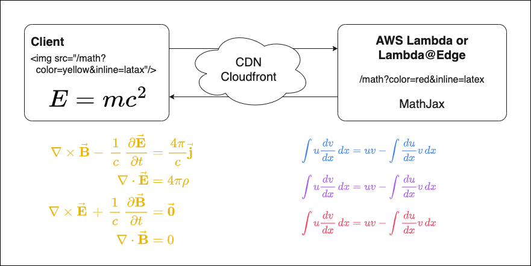

# Math Renderer

## Deploying the function to AWS Lambda

esbuild produces one JavaScript file with all dependencies. This is the only file that you need to
add to the .zip archive.

Steps:

- Create a new Lambda function on aws console, function name: `math-renderer`
- Run `yarn install & yarn build`, upload dist/index.zip file to lambda function
- Set the handler to `index.handler`
- Set the runtime to `Node.js 18.x`

Done!

## Use AWS Codebuild to build and deploy

- Create a new Codebuild project, project name: `math-renderer`
- Set the source to `https://github.com/hackertalk/math-renderer`
- Set the buildspec to `buildspec.yml`
- Set the environment to `Managed image`, operating system: `Ubuntu`, runtime: `Standard`,
  image: `aws/codebuild/standard:6.0`, environment type: `Linux`
- Select `New service role`, role name: `codebuild-math-renderer-service-role`

After creating the project, open IAM console, find the role `codebuild-math-renderer-service-role`,
attach the policy `AWSLambdaFullAccess` to it.
Or you can create a new policy and attach it to the role.

Required permissions:
actions: `lambda:UpdateFunctionCode`, `lambda:UpdateFunctionConfiguration`
Resource: `arn:aws:lambda:my-region:my-aws-account-id:function:math-renderer`

## Testing the function

## References

1. [Nodejs + Serverless 实现 LaTeX 公式渲染服务](https://markdowner.net/article/235800197744746496)
2. [typescript package](https://docs.aws.amazon.com/lambda/latest/dg/typescript-package.html)
